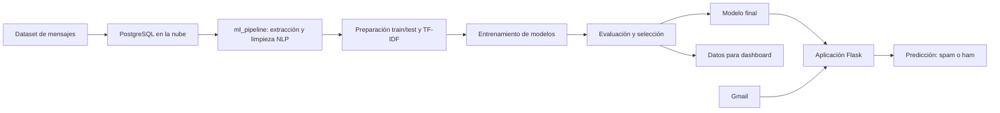

# Detector de Spam con Machine Learning y Gmail

Proyecto final de ciencia de datos orientado a la detección automática de correos no deseados (**spam**) y mensajes legítimos (**ham**). La solución está dividida en dos componentes principales:

1. **`ml_pipeline/`**: proyecto de entrenamiento y evaluación de modelos de machine learning.
2. **Aplicación Flask**: proyecto web independiente cuya raíz contiene `app/` y `run.py`, encargado de consultar correos de Gmail y realizar predicciones.

---

## Objetivo

Desarrollar una solución que permita:

- Extraer mensajes desde una base de datos PostgreSQL en la nube.
- Limpiar y transformar los textos mediante técnicas de NLP.
- Entrenar y comparar distintos modelos de clasificación.
- Seleccionar el mejor modelo para la detección de spam.
- Generar métricas para un dashboard de análisis.
- Consumir el modelo desde una aplicación Flask conectada a Gmail.

---

## Arquitectura general



---

## Estructura de los proyectos

La solución está organizada en **dos carpetas**.

### 1. Pipeline de machine learning

```text
ml_pipeline/
├── data/
│   └── spam.csv
├── models/
│   ├── candidato_LogReg.joblib
│   ├── candidato_NaiveBayes.joblib
│   ├── candidato_SVM.joblib
│   ├── candidato_RandomForest.joblib
│   └── modelo_final.joblib
├── src/
│   ├── dashboard/
│   │   ├── experiment_results.csv
│   │   ├── confusion_matrix.csv
│   │   └── hyperparameters.csv
│   ├── cargar_datos.py
│   ├── config.py
│   ├── fase_1_db.py
│   ├── fase_2.py
│   ├── fase_3.py
│   ├── fase_4.py
│   ├── fase_5.py
│   ├── metricas_dashboard.py
│   └── pipeline.py
├── .env
├── .env-template
└── requirements.txt
```

La carpeta `ml_pipeline/src/` contiene los scripts del proceso de datos, entrenamiento, evaluación y generación de métricas. La carpeta `ml_pipeline/models/` almacena los modelos entrenados.

### 2. Aplicación web Flask

La aplicación se encuentra en otra carpeta independiente. Su raíz contiene la aplicación y el archivo de ejecución:

```text
spam-detector/
├── app/
│   └── ... lógica, rutas, plantillas y servicios de la aplicación
├── data/
├── ml_pipeline/
│   └── ... integración o recursos del modelo para predicción
├── .env-template
├── .gitignore
├── credentials.json.example
├── README.md
├── requirements.txt
├── retrain_bilingual.py
└── run.py
```

> `spam-detector` representa el nombre de la carpeta que contiene `app/` y `run.py`.

---

## Tecnologías utilizadas

| Tecnología | Propósito |
|---|---|
| Python | Desarrollo de los dos componentes |
| Pandas / NumPy | Procesamiento y manipulación de datos |
| PostgreSQL | Base de datos de mensajes |
| SQLAlchemy | Conexión con PostgreSQL |
| NLTK | Limpieza de texto, stopwords y lematización |
| Scikit-learn | Preprocesamiento, modelos y evaluación |
| Joblib | Almacenamiento de modelos entrenados |
| Power BI | Visualización de métricas del dashboard |
| Flask | Aplicación web de clasificación |
| Gmail / OAuth | Lectura autorizada de correos |

---

## Dataset

El proyecto clasifica los mensajes en dos categorías:

| Etiqueta original | Valor numérico | Descripción |
|---|---:|---|
| `ham` | 0 | Mensaje legítimo |
| `spam` | 1 | Mensaje no deseado |

El script `ml_pipeline/src/cargar_datos.py` lee el archivo `data/spam.csv`, conserva las columnas `v1` y `v2`, y las almacena en PostgreSQL bajo la tabla `spam_raw`.

---

## Pipeline de machine learning

### Fase 0: carga del dataset a PostgreSQL

Archivo: `ml_pipeline/src/cargar_datos.py`

Este script:

1. Lee el dataset CSV.
2. Conserva las columnas correspondientes a etiqueta y mensaje.
3. Se conecta a PostgreSQL mediante variables de entorno.
4. Almacena los registros en la tabla `spam_raw`.

### Fase 1: extracción y limpieza de datos

Archivo: `ml_pipeline/src/fase_1_db.py`

El proceso obtiene los datos desde PostgreSQL y realiza:

- Eliminación de registros duplicados.
- Eliminación de valores nulos.
- Eliminación de enlaces y caracteres no alfabéticos.
- Conversión a minúsculas.
- Eliminación de stopwords en inglés.
- Lematización.
- Conversión de etiquetas: `ham = 0` y `spam = 1`.

Además, se generan variables adicionales:

| Variable | Descripción |
|---|---|
| `num_caracteres` | Longitud del mensaje |
| `num_mayusculas` | Número de letras mayúsculas |
| `num_digitos` | Número de dígitos presentes |

### Fase 2: preparación de variables

Archivo: `ml_pipeline/src/fase_2.py`

Esta fase divide el conjunto de datos en:

- `80%` para entrenamiento.
- `20%` para prueba.
- División estratificada con `random_state = 42`.

El preprocesador combina:

- **TF-IDF**, con un máximo de `3000` características de texto.
- **MinMaxScaler**, aplicado a las variables numéricas adicionales.

### Fase 3: entrenamiento de modelos

Archivo: `ml_pipeline/src/fase_3.py`

Se entrenan cuatro algoritmos candidatos:

| Modelo | Descripción |
|---|---|
| Logistic Regression | Clasificación lineal con balanceo de clases |
| Naive Bayes | Modelo probabilístico adecuado para texto |
| Support Vector Machine | Clasificador con kernel lineal |
| Random Forest | Ensamble de árboles con balanceo de clases |

Cada modelo se encapsula en un `Pipeline` de Scikit-learn que incluye el preprocesamiento y el clasificador. Los modelos entrenados se guardan en `ml_pipeline/models/`.

### Fase 4: evaluación y selección

Archivo: `ml_pipeline/src/fase_4.py`

Los modelos se evalúan con:

| Métrica | Interpretación |
|---|---|
| Accuracy | Proporción total de predicciones correctas |
| Precision | Cuántos correos marcados como spam realmente lo eran |
| Recall | Cuánto spam real logró detectar el modelo |
| F1-score | Balance entre precision y recall |
| Matriz de confusión | Distribución de aciertos y errores |

Los resultados se ordenan por **F1-score** y el modelo ganador se almacena como:

```text
ml_pipeline/models/modelo_final.joblib
```

### Fase 5: generación de métricas para dashboard

Archivo: `ml_pipeline/src/fase_5.py`

Esta fase realiza múltiples ejecuciones con distintas semillas para comparar el comportamiento de los modelos. Registra:

- `accuracy`, `precision`, `recall`, `f1_score` y `auc`.
- Verdaderos positivos, falsos positivos, verdaderos negativos y falsos negativos.
- Tiempo de entrenamiento e inferencia.
- Hiperparámetros.
- Modelo ganador por ejecución.
- Modelo señalado como candidato de producción.

Los datasets generados para el dashboard son:

```text
experiment_results.csv
confusion_matrix.csv
hyperparameters.csv
```

En la estructura actual estos archivos se encuentran en `ml_pipeline/src/dashboard/`.

> Nota técnica: `fase_5.py` construye la ruta de salida de manera relativa al directorio desde el cual se ejecuta. Para mantener siempre los CSV en `src/dashboard/`, puede ajustarse el parámetro `output_dir` o estandarizar el directorio de ejecución.

---

## Dashboard de métricas

El dashboard permite comparar el rendimiento de los modelos y analizar los tipos de error producidos.

Visualizaciones recomendadas:

- Comparación de `accuracy`, `precision`, `recall`, `f1_score` y `auc`.
- Matriz de confusión por modelo.
- Promedio de métricas en varias ejecuciones.
- Tiempos de entrenamiento e inferencia.
- Identificación del modelo de producción.
- Conteo de falsos positivos y falsos negativos.

En este problema, los errores tienen implicaciones distintas:

- Un **falso positivo** marca un correo legítimo como spam.
- Un **falso negativo** permite que un correo spam aparezca como legítimo.

---

## Aplicación web Flask e integración con Gmail

La aplicación Flask está en un proyecto diferente al pipeline y se identifica por contener las carpetas/archivos `app/` y `run.py`.

Su flujo funcional es:

1. El usuario autoriza el acceso a Gmail.
2. La aplicación obtiene los correos autorizados.
3. El mensaje es preparado para la predicción.
4. El modelo de clasificación se ejecuta.
5. La interfaz informa si el mensaje es **spam** o **ham**.

```text
Gmail autorizado
       ↓
Aplicación Flask: app/ + run.py
       ↓
Procesamiento del correo
       ↓
Modelo entrenado
       ↓
Resultado: SPAM / HAM
```

El proyecto Flask también incluye un archivo `retrain_bilingual.py`, que puede emplearse para procesos adicionales de reentrenamiento según la implementación de la aplicación.

---

## Instalación

Cada proyecto cuenta con su propio archivo `requirements.txt`, por lo que debe instalarse por separado.

### Instalar el pipeline de machine learning

```bash
cd ml_pipeline
python -m venv venv
```

Activar el entorno virtual en Windows:

```bash
venv\Scripts\activate
```

Activarlo en Linux o macOS:

```bash
source venv/bin/activate
```

Instalar dependencias:

```bash
pip install -r requirements.txt
```

### Instalar la aplicación Flask

Desde la carpeta que contiene `app/` y `run.py`:

```bash
python -m venv venv
```

Activar el entorno virtual correspondiente e instalar las dependencias:

```bash
pip install -r requirements.txt
```

---

## Variables de entorno

### Configuración del pipeline

En `ml_pipeline/.env`, definir la conexión a PostgreSQL:

```env
DB_USER=tu_usuario
DB_PASSWORD=tu_contrasena
DB_HOST=tu_host
DB_PORT=5432
DB_NAME=tu_base_de_datos
DB_SSLMODE=require
```

Puede utilizarse `ml_pipeline/.env-template` como guía para crear este archivo.

### Configuración de Flask y Gmail

La aplicación Flask contiene su propio `.env-template` y un archivo de ejemplo para credenciales. Deben configurarse las variables y credenciales requeridas por la integración OAuth de Gmail sin versionar información sensible.

Archivos que no deben subirse al repositorio:

```gitignore
.env
venv/
__pycache__/
credentials.json
token.json
*.joblib
```

---

## Ejecución del pipeline

Debido a que el archivo de datos está en `ml_pipeline/data/` y los scripts utilizan rutas relativas, los siguientes comandos se ejecutan desde la raíz de `ml_pipeline/`.

### 1. Cargar los datos en PostgreSQL

```bash
cd ml_pipeline
python src/cargar_datos.py
```

### 2. Ejecutar el pipeline completo

```bash
python src/pipeline.py
```

El pipeline realiza la limpieza, transformación, entrenamiento, evaluación y exportación de métricas.

### 3. Ejecutar solamente la fase de métricas

```bash
python src/fase_5.py
```

o:

```bash
python src/metricas_dashboard.py
```

> Si se desea que las métricas queden estrictamente en `ml_pipeline/src/dashboard/`, debe confirmarse la ruta de salida usada al ejecutar esta fase.

---

## Ejecución de la aplicación Flask

Desde la raíz del proyecto que contiene `app/` y `run.py`:

```bash
python run.py
```

La aplicación utiliza sus configuraciones de Flask y Gmail para consultar correos autorizados y realizar la clasificación.

---

## Resultados esperados

Al ejecutar el pipeline se generan:

```text
ml_pipeline/models/candidato_LogReg.joblib
ml_pipeline/models/candidato_NaiveBayes.joblib
ml_pipeline/models/candidato_SVM.joblib
ml_pipeline/models/candidato_RandomForest.joblib
ml_pipeline/models/modelo_final.joblib
```

Para el dashboard se generan:

```text
ml_pipeline/src/dashboard/experiment_results.csv
ml_pipeline/src/dashboard/confusion_matrix.csv
ml_pipeline/src/dashboard/hyperparameters.csv
```

El archivo `modelo_final.joblib` corresponde al clasificador elegido para integrarse con la aplicación de predicción.

---


## Autoría

Proyecto desarrollado como parte del curso de **Ciencia de Datos**.

- Autor: `DATANOVA`
- Fecha: `2026`

---

## Licencia

Proyecto desarrollado con fines académicos
